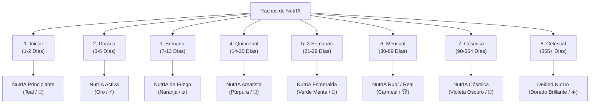

# 🦦 Catálogo Visual y Guía de Diseño de NutrIA

Este documento recopila todos los espacios del frontend donde se muestra o se debería mostrar a **NutrIA** (la mascota oficial de la aplicación). Se incluye el estado actual de las imágenes, los placeholders que requieren reemplazo y las especificaciones visuales sugeridas para la gamificación por **Rachas (Streaks)**.

---

## 1. Mapeo de Imágenes de NutrIA en la App

### 📂 Configuración Central: [mascotImages.js](file:///d:/Descargas%202.0/PROYECTO/frontend/src/constants/mascotImages.js)

El archivo centraliza todas las referencias de imágenes de la mascota. A continuación, se detalla qué imágenes están configuradas y cuáles son marcadas como placeholders genéricos:

| Clave en `MASCOT` | Propósito | Imagen/URL Actual | Estado |
| :--- | :--- | :--- | :--- |
| `logo` / `default` | Avatar superior, barra de hábitos, disclaimers, etc. | [1776015778388.png](https://i.postimg.cc/FsNKHJ22/1776015778388.png) | ✅ Dedicada |
| `wave` / `fullBody` | Pantalla de Bienvenida, Hero del Dashboard | [image.png](https://i.postimg.cc/HkWxnv71/image.png) | ✅ Dedicada |
| `somatotype.slim` | Biotipo Ectomorfo (onboarding paso 2) | [image.png](https://i.postimg.cc/bvYb5SnY/image.png) | ✅ Dedicada |
| `somatotype.athletic` | Biotipo Mesomorfo (onboarding paso 2) | [image.png](https://i.postimg.cc/JnGXrwP0/image.png) | ✅ Dedicada |
| `somatotype.robust` | Biotipo Endomorfo (onboarding paso 2) | [image.png](https://i.postimg.cc/Y2LFTHvY/image.png) | ✅ Dedicada |
| `training.gym` | Entrenamiento en gimnasio comercial | [image.png](https://i.postimg.cc/nh29qVWs/image.png) | ✅ Dedicada |
| `training.home` | Entrenamiento en casa con mancuernas | [image.png](https://i.postimg.cc/0j7bj9mR/image.png) | ✅ Dedicada |
| `training.outdoor` | Entrenamiento al aire libre (calistenia) | [image.png](https://i.postimg.cc/9FjDSq57/image.png) | ✅ Dedicada |
| `loading.frame1` | Animación de carga (tecleando) | [image.png](https://i.postimg.cc/pdyr8f8C/image.png) | ✅ Dedicada |
| `loading.frame2` | Animación de carga (eureka) | [image.png](https://i.postimg.cc/vT7ZM3RJ/image.png) | ✅ Dedicada |
| `detective` / `cheatMeal` | Buscador de alimentos / Detective | [image.png](https://i.postimg.cc/Gmghc4N3/image.png) | ✅ Dedicada |
| `somatotype` (unknown) | Biotipo "No estoy seguro" | `LOGO_FACE` | ⚠️ **Placeholder** |
| `training.injury` | Alerta de lesiones en el entrenamiento | `LOGO_FACE` | ⚠️ **Placeholder** |
| `emptyState.celebration` | Éxito en entrenamientos o metas de hábitos | `LOGO_FACE` | ⚠️ **Placeholder** |
| `emptyState.empty` | Pantallas de estados vacíos del diario/historial | `LOGO_FACE` | ⚠️ **Placeholder** |

---

## 2. Propuesta de Diseño para Placeholders Faltantes

Para lograr la mejor experiencia del usuario (Axioma 1) y watear visualmente al usuario (Aesthetics Rule), se sugieren los siguientes diseños específicos para los placeholders actuales:

### ❓ Biotipo "No estoy seguro" (`OnboardBio.jsx`)
*   **Concepto:** **NutrIA Analítica / Curiosa**.
*   **Descripción Visual:** La mascota con una lupa gigante, un sombrero de explorador o una pose pensativa mirando un signo de interrogación brillante. Transmite calma: *"No te preocupes, yo te ayudaré a definirlo"*.

### 🩹 Alerta de Lesiones (`TrainingScreen.jsx`)
*   **Concepto:** **NutrIA Protectora / Cuidadosa**.
*   **Descripción Visual:** NutrIA sentada con una pequeña venda adhesiva o una compresa de hielo en la cabecita, levantando un dedo en señal de advertencia amigable. Transmite autocuidado: *“Entrena suave hoy, tu salud es lo primero”*.

### 🎉 Celebración de Metas (`TrainingScreen.jsx` / `HabitsScreen.jsx`)
*   **Concepto:** **NutrIA Triunfante / Festiva**.
*   **Descripción Visual:** NutrIA saltando alegremente con confeti de colores a su alrededor, sosteniendo una medalla brillante o levantando una pequeña copa dorada.

---

## 3. Propuesta Visual para Rachas (Streaks)

En el componente [StreakBadge.jsx](file:///d:/Descargas%202.0/PROYECTO/frontend/src/components/domain/StreakBadge.jsx), el sistema maneja ocho niveles de compromiso basados en los días consecutivos de uso. Cada nivel cuenta con sus propios colores, gradientes, etiquetas de badge y animaciones.

A continuación se detalla la propuesta visual dedicada de NutrIA para cada nivel:

---

### 1️⃣ Racha Inicial (Días 1 a 2)
*   **Lógica del Código:** `streak < 3`. Color temático: **Teal** (`#2BBCB9`).
*   **Mensajes Asociados:** 
    *   *“¡Día 1! Cada gran viaje comienza así 🦦”*
    *   *“¡2 días seguidos! Vas muy bien 💪”*
*   **Concepto Visual (NutrIA Principiante):**
    *   La mascota con ropa deportiva casual (o zapatillas sencillas), sonriendo y haciendo un gesto de saludo amigable con la patita. Transmite optimismo y frescura.

### 2️⃣ Racha Dorada (Días 3 a 6)
*   **Lógica del Código:** `streak >= 3` y `streak < 7`. Color temático: **Oro** (`#F5A623`).
*   **Mensajes Asociados:**
    *   *“¡3 días de racha! Eres imparable ✨”*
    *   *“¡5 días! Tu disciplina inspira 🌟”*
*   **Concepto Visual (NutrIA Activa / Radiante):**
    *   La mascota con destellos dorados a su alrededor, guiñando un ojo y luciendo unos lentes oscuros retro. Transmite confianza y ritmo constante.

### 3️⃣ Racha Semanal (Días 7 a 13)
*   **Lógica del Código:** `streak >= 7` y `streak < 14`. Color temático: **Naranja Fuego** (`#FF6B35`).
*   **Mensajes Asociados:**
    *   *“¡1 semana completa! NutrIA está orgullosa 🎉”*
*   **Concepto Visual (NutrIA de Fuego / Super Sai-NutrIA):**
    *   La mascota rodeada de una simpática aura de fuego animada (llamas estilizadas, no amenazantes). Animación de parpadeo de borde activada en la tarjeta.

### 4️⃣ Racha de 2 Semanas (Días 14 a 20)
*   **Lógica del Código:** `streak >= 14` y `streak < 21`. Color temático: **Amatista** (`#7E57C2`).
*   **Mensajes Asociados:**
    *   *“¡2 semanas! Tu constancia es ejemplar 🏆”*
*   **Concepto Visual (NutrIA Mágica / Mística):**
    *   La mascota sentada al lado de una bola de cristal amatista que brilla, vistiendo una capa mágica estrellada. Transmite la sabiduría de haber mantenido el hábito por dos semanas.

### 5️⃣ Racha de 3 Semanas (Días 21 a 29)
*   **Lógica del Código:** `streak >= 21` y `streak < 30`. Color temático: **Verde Esmeralda** (`#24A17F`).
*   **Mensajes Asociados:**
    *   *“¡3 semanas seguidas! Un hábito completamente arraigado 🌿”*
*   **Concepto Visual (NutrIA Natural / Vital):**
    *   La mascota trepada en una pequeña rama de bambú, sosteniendo una hoja verde fresca de la cual gotea rocío. Transmite el crecimiento orgánico del hábito saludable.

### 6️⃣ Racha Mensual (Días 30 a 89)
*   **Lógica del Código:** `streak >= 30` y `streak < 90`. Color temático: **Carmesí Rubí / Royal** (`#E25C5C`).
*   **Mensajes Asociados:**
    *   *“¡1 mes entero! ¡Tu dedicación es de otro nivel! 👑”*
*   **Concepto Visual (NutrIA de la Realeza):**
    *   La mascota portando una pequeña corona dorada y una capa de terciopelo rojo con bordes blancos, sentada en un mini trono de madera. Transmite distinción y realeza en su consistencia.

### 7️⃣ Racha Cósmica (Días 90 a 364)
*   **Lógica del Código:** `streak >= 90` y `streak < 365`. Color temático: **Violeta Cósmico** (`#9F56D2`).
*   **Mensajes Asociados:**
    *   *“¡3 meses de racha! ¡Tu constancia es legendaria y cósmica! 🌌”*
*   **Concepto Visual (NutrIA Astronauta / Galáctica):**
    *   La mascota flotando en gravedad cero, vestida con un mini traje espacial transparente, con estrellas y nebulosas violetas flotando a su alrededor. Animación de flotado vertical continuo activada.

### 8️⃣ Racha Celestial (Días 365 o más)
*   **Lógica del Código:** `streak >= 365`. Color temático: **Dorado Celestial** (`#E5C158`).
*   **Mensajes Asociados:**
    *   *“¡1 año completo! ¡Has alcanzado la trascendencia con NutrIA! ☀️”*
*   **Concepto Visual (Deidad NutrIA / Trascendental):**
    *   La mascota flotando serenamente sobre una nube blanca esponjosa, con un pequeño halo de luz solar sobre su cabecita y destellos iridiscentes a su alrededor. Transmite la máxima trascendencia en la salud y el bienestar.

